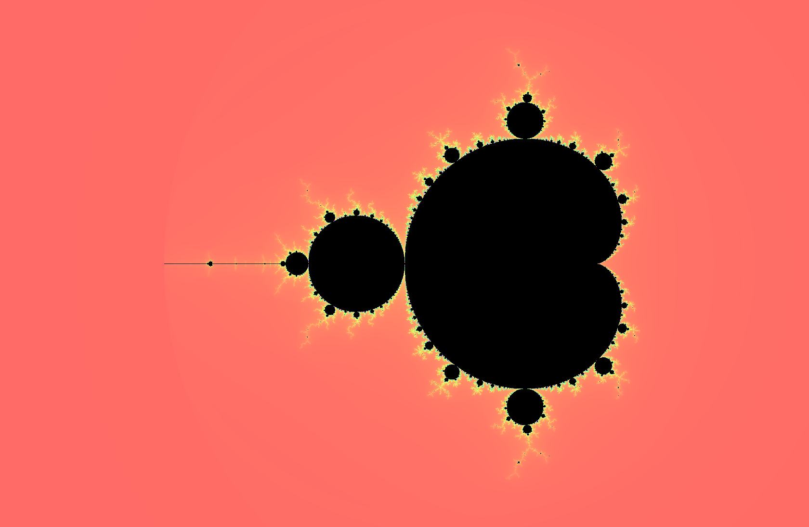
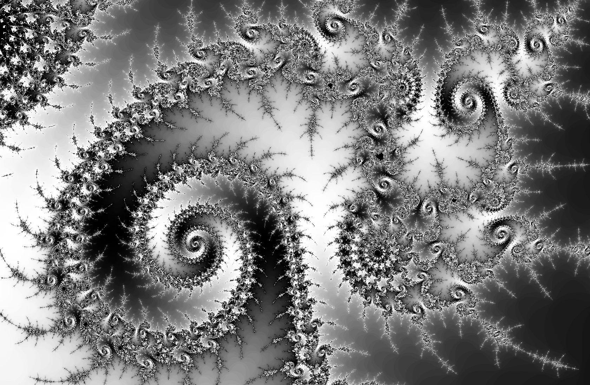
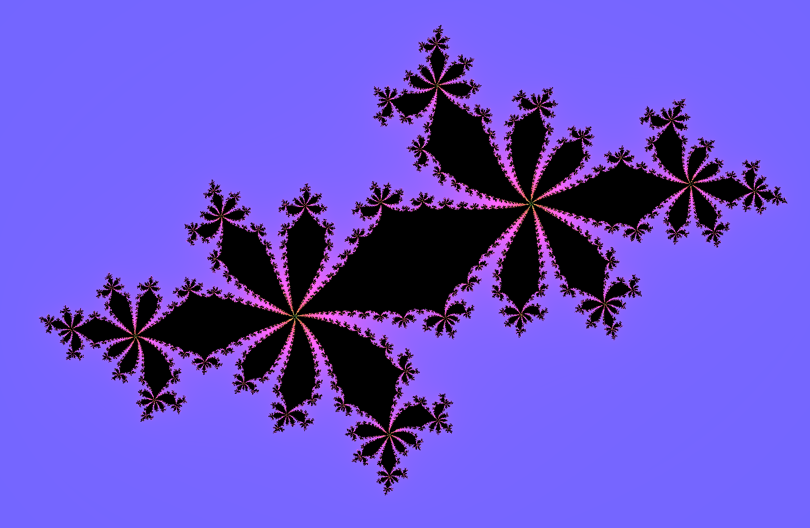
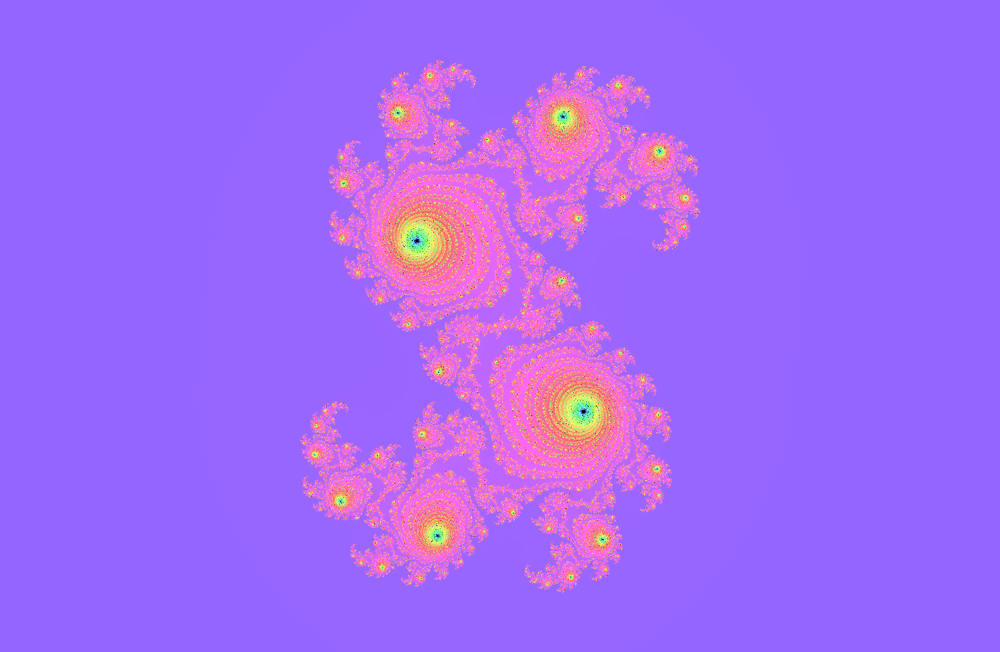
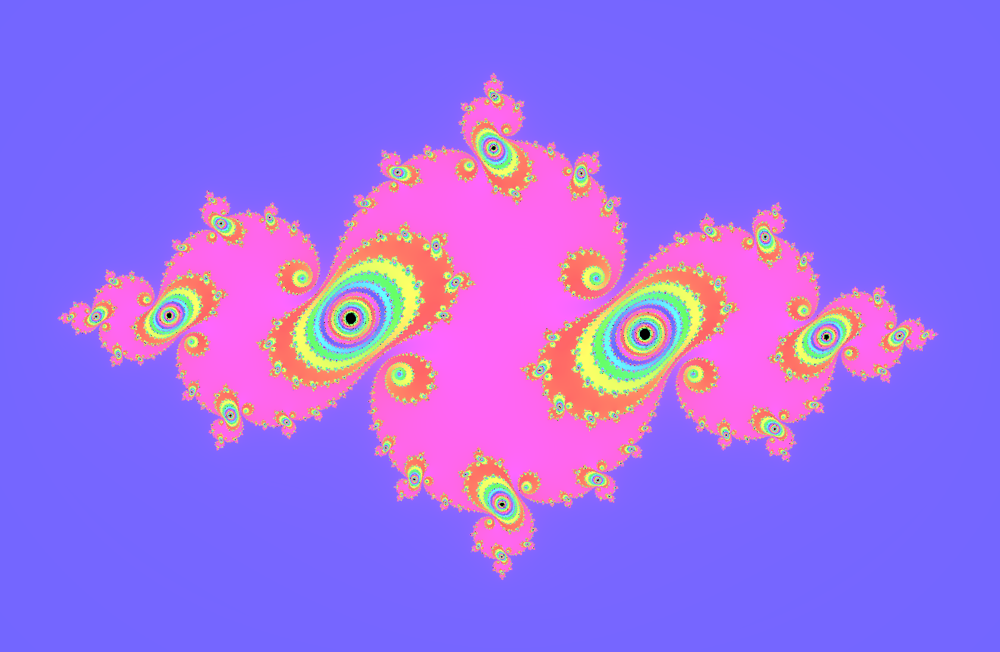
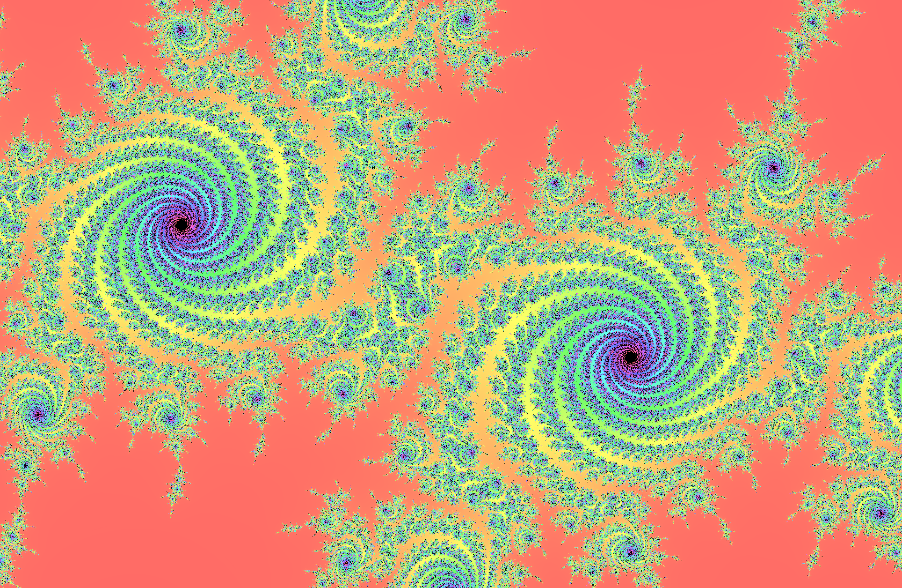
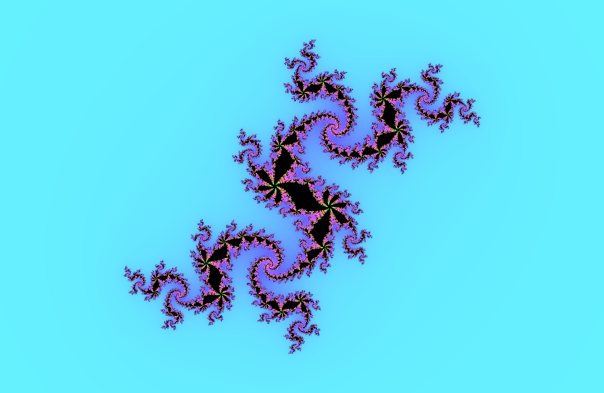

# Mandelbrot

Mandelbrot is a Java application that generates and displays the Mandelbrot Set,
one of the most famous and beautiful fractals.

Mandelbrot can navigate the fractal, and zoom in down to floating point precision.
A selection of customizable brushes is available to view the fractal in 
different ways.

Mandelbrot also supports Julia Set generation based on a seed selected by clicking
on the Mandelbrot Set.

## Usage

To compile, run `javac */*.java` in the `mandelbrot/` directory. To run Mandlebrot, `cd ..` and run `java mandelbrot.core.Mandelbrot`.

## Contributing

Want to help? You can create new brushes, add features to the GUI, or improve
the core fractal generating code. Here's how:

1. Fork it!
2. Create your feature branch: `git checkout -b myFeature`
3. Commit your changes: `git commit -am 'Add some feature'`
4. Push to the branch: `git push origin myFeature`
5. Submit a merge request

## Authors

* **Kiran Tomlinson**

## License

This project is licensed under the MIT License - see the [LICENSE](LICENSE)
file for details

## Gallery
### Detail

### Julia Sets

